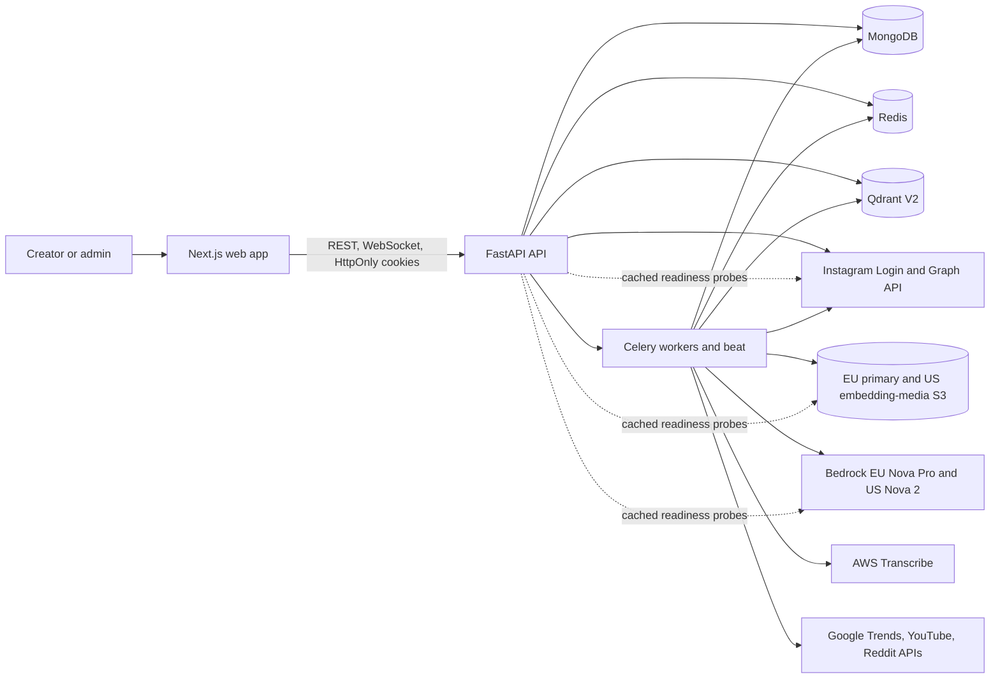
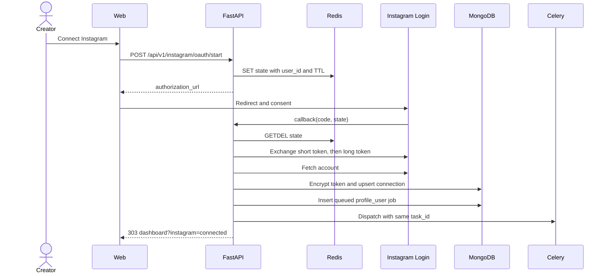
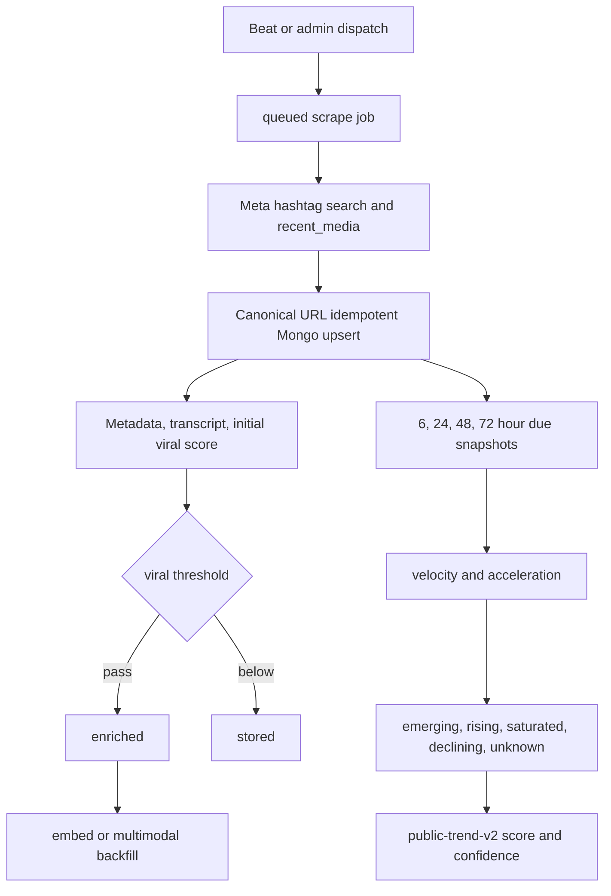
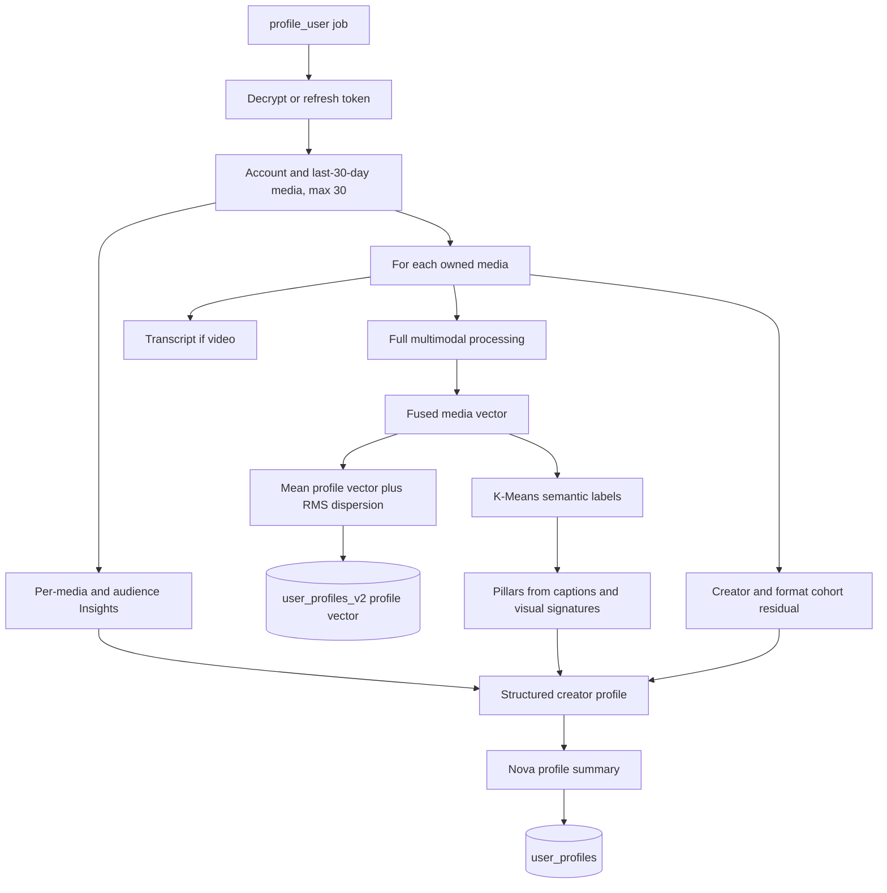
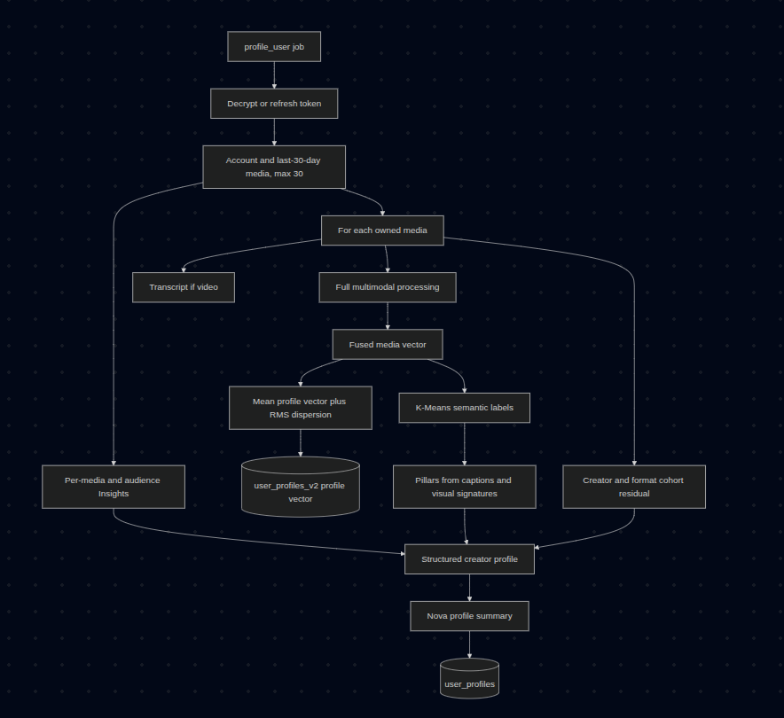
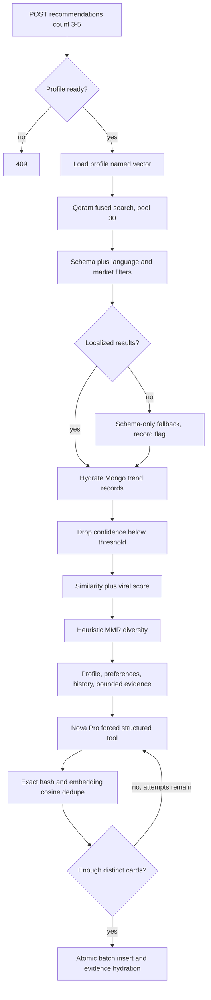
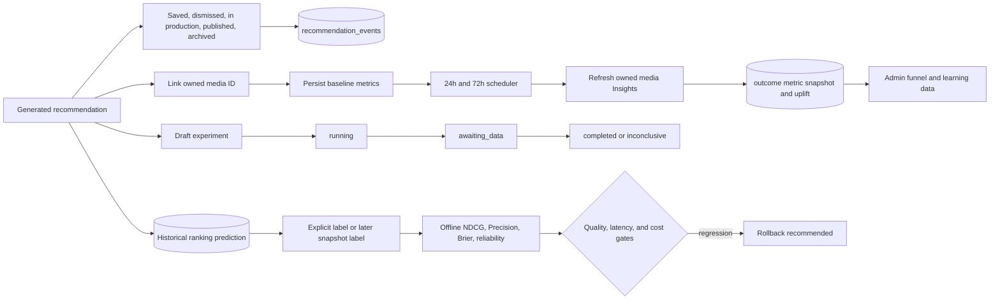
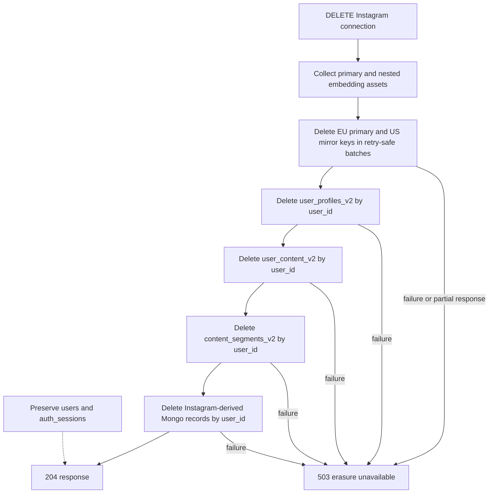
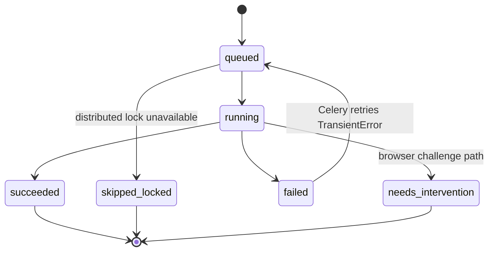
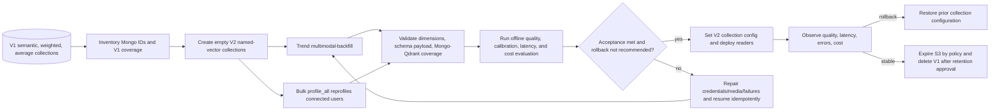

# Involo Production System Architecture

This document describes the implemented system. Code in `backend/app`, `frontend/src`,
the environment model, and Compose files is authoritative when this document and code
diverge. The repository also contains legacy comments and tests that use historical
“phase” terminology; phases are not production-readiness claims.

## 1. Product context and boundaries

Involo is creator intelligence for Instagram Business creators. It:

1. discovers public Instagram hashtag content through the official Meta Graph API;
2. enriches, scores, snapshots, and embeds trend content;
3. connects a creator-owned Instagram account with Instagram Login;
4. builds a multimodal creator profile from recent owned media and Insights;
5. retrieves relevant trend evidence and generates production-detailed shoot briefs;
6. records recommendation decisions, published-post links, outcomes, and experiments.

Google Trends, YouTube, and Reddit are optional **external topic signals**. Their
scores are stored separately and are never represented as Instagram reach,
engagement, or Insights.

### System context



### Trust boundaries

- Browser: untrusted input and rendered content; only `NEXT_PUBLIC_*` values are
  browser-visible.
- API: authentication, authorization, request validation, rate limiting, and job
  creation.
- Worker: privileged external-provider and data-plane access.
- Data plane: MongoDB is the record of truth; Qdrant is a derived retrieval index;
  S3 contains derived/source media artifacts; Redis contains ephemeral coordination.
- Providers: all provider responses, captions, OCR, and trend text are untrusted.

## 2. Deployable services and code boundaries

| Boundary | Implementation | Responsibility |
|---|---|---|
| Web | Next.js 16 / React 19 | Auth, onboarding, dashboard, profile, recommendations, admin views |
| API | FastAPI / Python 3.12 | HTTP contract, cookie auth, RBAC, OAuth callback, synchronous recommendation generation, job dispatch |
| Worker | Celery | Scrape, enrich, embed, profile, snapshots, outcomes, topic signals, multimodal backfill |
| Scheduler | Celery Beat | Runs `scheduled_dispatch` every 60 seconds; DB-driven cron and hourly intelligence jobs |
| MongoDB 8 | `Resources` and services | Durable entities, configs, jobs, metrics, provenance, feedback |
| Redis 7 | Celery and runtime helpers | Broker/result backend, locks, rate limits, OAuth state, hourly dispatch keys, live logs |
| Qdrant | V2 collections | Named-vector retrieval and segment evidence |
| S3/MinIO | media/transcribe buckets | Downloaded media, keyframes, segments, transcription staging |

Backend packages are intentionally layered:

- `api`: routers, dependencies, response mapping, app lifespan;
- `core`: settings, crypto, auth, rate limits, cron, error classification;
- `schemas`: validation and public/domain contracts;
- `services`: workflows and deterministic business rules;
- `providers`: Meta, AWS, Bedrock, and licensed signal adapters;
- `infrastructure`: resource initialization, migrations, log bus;
- `workers`: tasks, locks, retries, scheduler, job lifecycle.

Compose starts only MongoDB, Redis, Qdrant, MinIO, and bucket initialization.
`run.sh` starts API, worker, beat, and frontend on the host. The Compose images use
floating `latest` tags for Qdrant and MinIO; production deployment must pin tested
digests and add authentication/private networking.

## 3. Provider map and production dependencies

| Capability | Implemented provider | Configuration |
|---|---|---|
| Public trend discovery | Meta Hashtag Search + `recent_media` | Meta app, trend token, Instagram Business account ID |
| Optional browser discovery | Playwright Instagram adapter | `INVOLO_SCRAPER_ADAPTER=instagram`; not a compliant production fallback |
| Metadata | Official Meta discovery metadata | Meta trend discovery payload |
| Owned profile/media/Insights | Instagram Login + Graph API v25.0 default | App ID/secret, exact redirect URI |
| Transcription | ffmpeg audio extraction, S3, AWS Transcribe | `eu-central-1` default AWS region and transcribe bucket |
| Visual analysis | Nova Pro through Bedrock Converse | `eu.amazon.nova-pro-v1:0` inference profile in `eu-central-1` |
| Text/media embedding | Nova 2 Multimodal Embeddings | `amazon.nova-2-multimodal-embeddings-v1:0`, 1024 dimensions, in-region `us-east-1` |
| Profile narrative | Bedrock Converse | EU Nova Pro inference profile in `eu-central-1` |
| Shoot-brief generation | Bedrock Converse with forced tool result | EU Nova Pro inference profile in `eu-central-1` |
| Topic signals | approved Google Trends API, YouTube Data API v3, Reddit OAuth Data API | each connector separately enabled |

The current provider factories instantiate production providers; there is no runtime
fake/fixture selector for embedding, profile, or recommendation generation. Tests use
test doubles. Local execution of provider-dependent flows therefore requires valid
credentials and buckets.

### Meta source distinction

- **OAuth/owned data:** Instagram Login requests
  `instagram_business_basic` and `instagram_business_manage_insights`. The system
  reads the connected creator’s account, up to 30 media from the prior 30 days,
  media Insights, and audience Insights.
- **Public trends:** a separately configured long-lived token and Instagram Business
  account call `ig_hashtag_search` and `recent_media`. Records include
  `source=meta_instagram_hashtag`, license, permalink, hashtag ID, and API version.
- **External topics:** Google/YouTube/Reddit capture topic-level demand or engagement
  samples into `topic_signal_*`. They are not joined into Instagram metric fields or
  the implemented recommendation rank formula.

## 4. System workflows

### 4.1 OAuth and onboarding



State is random, user-bound, TTL-limited, and atomically single-use. Tokens are
authenticated-encrypted before Mongo persistence and refreshed when fewer than seven
days remain. An account ID is unique across local users. Profile status progresses
`disconnected -> connected -> profiling -> ready`; errors include `failed` and
`needs_reauth`.

Creator preferences are maintained separately (`PUT /preferences`) and constrain
markets, languages, niches, goals, timezone, and production constraints.

### 4.2 Trend ingest, snapshots, score, and lifecycle



Discovery upserts by unique canonical URL, updates `last_seen_at`, and accumulates
keywords. Snapshot identity is `(subject_type, subject_id, offset_hours)` and is
idempotent. The due window is 1.5 hours. Missing metrics remain missing, are recorded
in coverage, and are not coerced into synthetic zero.

The initial viral score uses engagement, follower-adjusted reach, and recency.
`public-trend-v2` later combines engagement, non-negative velocity, percentile
(currently absent/zero), and seven-day freshness. Confidence combines metric
coverage and denominator size. Lifecycle needs at least two view snapshots:

- velocity <= 0: declining;
- positive acceleration: rising;
- negative acceleration: saturated;
- otherwise positive velocity: emerging;
- insufficient snapshots: unknown.

### 4.3 Multimodal video pipeline

```mermaid
flowchart LR
    URL[HTTP(S) media URL] --> DL[Bounded streaming download]
    DL --> S3M[EU primary S3 media object]
    S3M --> FF[ffmpeg]
    FF --> Frames[EU primary keyframes]
    FF --> Segments[EU primary 5-30 second segments]
    Frames --> MirrorFrames[Mirror keyframes to US embedding S3]
    Segments --> MirrorSegments[Mirror segments to US embedding S3]
    S3M --> Vision[Nova Pro video plus ordered frames]
    Frames --> Vision
    Vision --> Structured[Validated VisualAnalysis]
    Structured --> TextInput[Caption, transcript, opening frame, OCR, visual signature]
    TextInput --> TextVec[Nova text embedding]
    MirrorSegments --> SegmentVec[Nova video embeddings in us-east-1]
    SegmentVec --> Pool[L2 normalize each, mean, L2 normalize]
    TextVec --> Fuse[Weighted fusion and L2 normalize]
    Pool --> Fuse
    Fuse --> ContentPoint[Qdrant text, audio_video, fused]
    SegmentVec --> SegmentPoints[Qdrant segment points]
    MirrorFrames --> FrameVec[Nova image embeddings in us-east-1]
    FrameVec --> FramePoints[Qdrant keyframe points]
```

Downloads accept only HTTP(S), follow redirects, and stop at
`INVOLO_MEDIA_MAX_DOWNLOAD_BYTES`. ffmpeg creates configured keyframes (defaults
0, 1, 3, 5 seconds) and 15-second H.264/AAC segments. A short video may omit
out-of-range frames; producing no segment fails processing.

Nova Pro receives the primary source video, ordered primary keyframes, and a bounded
caption in `eu-central-1` through `eu.amazon.nova-pro-v1:0`.
Forced Bedrock tool use must validate as `VisualAnalysis`: opening frame, hook
timing, OCR, faces, objects, shot changes, pacing, overlay style, visual signature,
safety/originality notes, and confidence. The prompt labels caption/OCR as
untrusted instructions.

Nova 2 Multimodal Embeddings currently has no geographic inference profile in this
deployment. It is invoked with the plain in-region
`amazon.nova-2-multimodal-embeddings-v1:0` model ID in `us-east-1`, using
`SINGLE_EMBEDDING`, `GENERIC_INDEX`, END text truncation, S3 media locations, and
1024 dimensions. Every segment is embedded independently. Segment pooling avoids
long videos dominating by count:
normalize each segment, arithmetic mean, normalize the result. Fusion defaults to
45% text and 55% media, renormalizes weights when a modality is absent, and
L2-normalizes the final vector.

The default `embed` job selects enriched trend records with a media URL and invokes
this complete S3/Nova pipeline through `MultimodalService.run_eligible`. The
`multimodal-backfill` job invokes the same processing implementation for records
whose schema version differs or whose visual analysis/segments are absent. Both
write deterministic schema-versioned content and segment points; backfill repairs or
migrates existing records rather than providing a different embedding mode.

### 4.4 Creator profiling




User media bypasses the public viral threshold. Per-media failures are isolated; if
all media fail, the profile job fails. The profile vector is the arithmetic mean of
successful fused vectors; `vector_std_dev` is RMS Euclidean dispersion.

Performance is a z-residual within the creator’s media-format cohort, transformed to
0-100 with confidence based on cohort size and metric coverage. For fewer than four
items one semantic pillar is used; otherwise K-Means chooses 2-4 clusters based on
sample size. Pillar names use frequent caption terms and visual signatures; strengths
and opportunities depend on mean residual. These labels are heuristic, not a
taxonomy or causal claim.

### 4.5 Retrieval, rerank, MMR, and generation



Qdrant search uses `fused`, requires the active `schema_version`, and applies
language/market `MatchAny` filters when preferences exist. Empty localized results
retry with only schema filtering and persist `localized_fallback=true`.

Cosine similarity is mapped to [0,1] for reranking. Rank is
`(1 - viral_weight) * similarity + viral_weight * viral_score/100`; default viral
weight is 0.2. Low-confidence public trends are removed. MMR selects up to top-k
using relevance and a binary diversity penalty if source or format matches
an already selected item. This is a heuristic MMR, not pairwise vector MMR.

Nova Pro receives bounded, explicitly untrusted trend evidence; only supplied
evidence IDs may be cited. Forced structured output produces a full shoot brief:
objective, audience, first frame, 0-3s hook, script beats, shot list, overlays,
duration, location, props, audio, caption, hashtags, A/B hooks, publish window,
why-now, and originality guardrail. Evidence IDs are hydrated server-side with
trend ID, permalink, similarity, lifecycle, confidence, snapshot time, and score
components; model-invented evidence IDs are dropped.

Generated cards are deduplicated against history and the current batch by normalized
SHA-256 and embedding cosine threshold. The batch is inserted only after the exact
requested count is accepted. A per-user Redis lock and hourly rate limit protect the
synchronous generation endpoint.

### 4.6 Feedback, post links, outcomes, and experiments



Recommendation events require a caller-provided idempotency key unique per user.
Post linking verifies both recommendation ownership and owned media ownership, then
schedules 24/72-hour outcomes. Outcome uplift is `(current-baseline)/max(abs(baseline),1)`
for available metrics only. Current code marks `outcome_status=captured` after each
capture while retaining remaining offsets in `outcome_offsets_pending`.

Experiment transitions are enforced:
`draft -> running -> awaiting_data -> completed|inconclusive`; `running` may also
become `inconclusive`. The implementation stores experiment state and notes but does
not automatically assign traffic or calculate significance.

Each recommendation batch also records `retrieval-filtered-fused-mmr-v2` candidates
with rank and a bounded probability derived from normalized similarity plus viral
weight. These historical predictions are the input to offline evaluation.

## 5. API contract

All application endpoints use `/api/v1`; health endpoints are unprefixed. OpenAPI is
served by FastAPI at `/docs` and `/openapi.json`.

| Area | Methods and paths | Auth |
|---|---|---|
| Health | `GET /health/live`, `GET /health/ready` | Public |
| Auth | `POST /auth/register`, `/login`, `/refresh`, `/logout`; `GET /auth/me` | Public/cookies |
| Preferences | `GET|PUT /preferences` | User |
| Instagram | `POST /instagram/oauth/start`; `GET /instagram/oauth/callback`, `/instagram/status`; `DELETE /instagram/connection` | User except provider callback |
| Profile | `POST /profile/sync`; `GET /profile/analytics` | User |
| Recommendations | `POST|GET /recommendations` | User |
| Learning | `POST /recommendations/{id}/events`, `POST /recommendations/{id}/post-link` | User |
| Experiments | `POST /recommendation-experiments`; `PATCH /recommendation-experiments/{id}` | User |
| Admin scrape | config, run, latest/run detail, WebSocket logs | Admin |
| Admin pipeline | `POST /admin/pipeline/{enrich|embed|multimodal-backfill}`, latest runs, stats | Admin |
| Admin profiling | config, estimate, bulk run, latest | Admin |
| Admin system | overview, jobs, `GET /admin/observability`, `POST /admin/evaluations/run` | Admin |

Cookie clients must send credentials. `involo_access` and `involo_refresh` are
HttpOnly. Jobs return HTTP 202 and a job document with `task_id` exposed as `id`,
kind, state, counters, and timestamps. Recommendation generation is synchronous and
returns 409 for prerequisites, 429 for lock/rate limit, 502 for generation/provider
failure, and 503 for retrieval/embedding infrastructure failures.
Instagram disconnect returns 204 only after derived-store erasure completes; an
incomplete S3, Qdrant, or Mongo erasure returns 503 with
`instagram_disconnect_erasure_unavailable`. Offline evaluation returns 409 when no
labeled historical rankings are available for the requested model/cutoff.

See [API_EXAMPLES.md](API_EXAMPLES.md) for non-secret examples.

## 6. Data dictionary and persistence

### 6.1 MongoDB collections and indexes

| Collection | Purpose | Implemented indexes |
|---|---|---|
| `users` | email, Argon2 password hash, role, disabled | unique email; role |
| `auth_sessions` | hashed refresh token, family, expiry, revoke | unique token hash; user+revoked; TTL expiry |
| `scraper_config` | singleton keywords, limits, score/cron config | unique key |
| `trend_content` | discovery, provenance, metrics, snapshots-derived score, primary/mirrored media analysis, processing regions, vector ID | unique canonical URL; sparse shortcode; last seen desc |
| `job_runs` | queued/running/terminal state, counters, errors, log tail | unique task ID; created desc; kind+created |
| `instagram_connections` | encrypted token, account identity, status | unique user; unique sparse Instagram user ID |
| `user_content` | owned-media metrics, transcript, primary/mirrored multimodal artifacts, processing regions, performance | unique user+media; user+taken desc |
| `user_profiles` | profile vector ID, dispersion, structured/narrative profile | unique user |
| `profiling_config` | singleton bulk-profile cron | unique key |
| `recommendations` | batches, cards, retrieval provenance, model usage | user+created desc |
| `content_metric_snapshots` | trend and outcome point-in-time metrics | unique subject type+ID+offset; captured desc |
| `audience_snapshots` | country/city/demographic/online audience data | user+captured desc; unique sparse provider snapshot ID |
| `user_preferences` | localization, niche, goals, constraints | unique user |
| `recommendation_events` | explicit recommendation lifecycle feedback | user+created desc; unique user+idempotency key; recommendation+created |
| `recommendation_post_links` | recommendation-to-owned-post mapping and pending outcomes | unique user+recommendation; unique user+media |
| `recommendation_experiments` | variants and state machine | user+created desc; recommendation |
| `provider_runs` | sanitized provider/model/stage/region state, duration, media seconds, subject/user linkage; topic connector runs | provider+created; state+created; provider+model+stage+created; user+created |
| `topic_signal_snapshots` | source-specific licensed topic observations | topic+captured desc; source+captured desc |
| `topic_signal_aggregates` | latest per-topic cross-source normalization | unique topic |
| `ranking_predictions` | retrieval model version, ranked candidates/probabilities, later labels, and optional historical latency/cost fields | model+predicted desc; user+predicted desc |
| `evaluation_runs` | cutoff-specific offline metrics, gates, pass and rollback recommendation | model+created desc; passed+created desc |
| `schema_migrations` | applied additive migration versions | unique version |

Key embedded documents:

- trend/user media: source IDs, canonical/permalink, caption/transcript, timestamps,
  raw metrics, coverage, score/version/components, media S3 object, keyframes,
  segments, visual analysis, vector/schema IDs, processing state/error;
- recommendation: profile revision, retrieval strategy/fallback/provenance, cards,
  dedupe material, provider/model ID, token usage;
- profile: `creator-profile-v2`, semantic pillars, format patterns, audience/target
  markets, languages, niches, goals, constraints, and data quality.

Mongo has no transaction spanning Qdrant or S3. Reconciliation/backfill is therefore
required after partial writes.

### 6.2 Qdrant V2

All vectors use cosine distance and configured dimensions.

| Default collection | Named vectors | Payload/use |
|---|---|---|
| `trend_content_v2` | `text`, `audio_video`, `fused` | Mongo ID, source, language, market, lifecycle, score, schema; retrieval and source/format diversity |
| `user_content_v2` | `text`, `audio_video`, `fused` | user/media IDs, language, market, score, schema; owned-media representation |
| `user_profiles_v2` | `profile` | user ID, username, count, update time; recommendation query |
| `content_segments_v2` | `segment` | parent point, type, index/time, S3 URI, content/user/source metadata, schema |

Payload indexes are created for keyword fields `language`, `market`, `lifecycle`,
`schema_version`, `content_type`, and `user_id`, plus Boolean `active`, on trend,
user-content, and segment collections. Segment points
cover video segments and keyframes and carry `timestamp_seconds` for evidence
localization. Content and segment IDs are deterministic UUIDv5 over collection,
content type/owner/content, artifact position, and schema version. Profile IDs are
deterministic per user.

### 6.3 Regional processing, S3 layout, retention, and residency

The implemented default region topology is:

| Stage/store | Region and identifier |
|---|---|
| Transcribe/default AWS | `eu-central-1` (`INVOLO_AWS_REGION`) |
| Nova Pro vision/profile/recommendation | `eu-central-1` (`INVOLO_BEDROCK_GENERATION_REGION`) with `eu.amazon.nova-pro-v1:0` |
| Primary media S3 | `eu-central-1` (`INVOLO_MEDIA_S3_REGION`) |
| Nova 2 text/media embedding | `us-east-1` (`INVOLO_BEDROCK_EMBEDDING_REGION`) with in-region `amazon.nova-2-multimodal-embeddings-v1:0` |
| Embedding-media S3 | `us-east-1` (`INVOLO_EMBEDDING_MEDIA_S3_REGION`) |

Primary and embedding-media layouts are:

```text
s3://<primary-media-bucket>/content-intelligence/
  media/<content_id>.<source-extension>
  keyframes/<content_id>/<offset_ms_zero_padded>.jpg
  segments/<content_id>/<segment_index_zero_padded>.mp4

s3://<embedding-media-bucket>/content-intelligence/embedding/
  keyframes/<content_id>/<offset_ms_zero_padded>.jpg
  segments/<content_id>/<segment_index_zero_padded>.mp4
```

The original media, keyframes, and segments are created in the EU primary bucket.
Before media embedding, each keyframe and segment is downloaded and uploaded to the
US embedding bucket under the deterministic `embedding/` mirror path. The original
video is not mirrored: EU Nova Pro vision reads the EU source video/keyframes, while
US Nova 2 reads the mirrored keyframe/segment objects. Text embedding runs in the US
but does not use S3.

Embedding-media storage has independent
`INVOLO_EMBEDDING_MEDIA_S3_BUCKET`, `_REGION`, `_ENDPOINT_URL`, and
`_BUCKET_OWNER` settings. The primary bucket uses `INVOLO_MEDIA_S3_BUCKET`,
`_REGION`, and `_BUCKET_OWNER` (and the shared local S3 endpoint setting). Bucket
owner IDs are included in Bedrock S3 locations when configured. A custom embedding
endpoint is useful only outside production; production requires regional AWS S3.

Mongo keyframe and segment records retain the primary asset plus nested
`embedding_asset` bucket/key/URI/region. Qdrant content/segment payloads contain
`embedding_region=us-east-1` and `generation_region=eu-central-1`; segment `s3_uri`
references the embedding-region mirror. Mongo trend/user-content documents also
persist `processing_regions` for vision, text embedding, and media embedding.
Instrumented provider telemetry persists the actual `region` beside provider, model,
and stage.

Uploads set content type, SSE-S3 (`AES256`), `managed-by=involo`, a
`retention-until` metadata timestamp, and `retention-days` tag. This metadata does
**not delete objects**. Production must install and verify an S3 lifecycle rule
matching the prefix/tag in **both** media buckets for
`INVOLO_MEDIA_RETENTION_DAYS` (30 default). Object Lock is not requested. The
separate transcription bucket holds transcription staging objects according to the
transcription provider.

Instagram disconnect collects the stored media, keyframe, and video-segment keys
from `user_content`, recursively includes each nested `embedding_asset`, groups by
bucket, and deletes primary and mirrored objects in batches of at most 1,000 using
the correct regional client. S3 partial-delete errors fail the operation. Lifecycle
expiration remains a defense-in-depth mechanism for orphaned objects.

This topology intentionally transfers derived creator/public media frames and video
segments from the EU to `us-east-1` for embedding, and text embedding also executes
there. It is therefore not EU-only processing or storage. Production privacy,
customer disclosure, DPIA/transfer assessment, AWS account/region controls, bucket
policies, KMS strategy, retention, backups, incident response, and contractual data
residency commitments must explicitly cover both regions. If US processing is not
acceptable, this model topology cannot be represented as EU-resident merely by
keeping the primary bucket in Europe.

## 7. Authentication, security, privacy, and compliance

- Passwords: Argon2.
- Access: short-lived signed JWT in HttpOnly cookie.
- Refresh: opaque high-entropy token; SHA-256 hash only in Mongo; rotation/revoke.
- Authorization: user and current DB-backed admin-role dependencies.
- Cookies: Secure required in production; SameSite configurable, and `None` requires
  Secure.
- OAuth: random single-use Redis state; exact redirect URI; encrypted long token.
- Network: explicit credentialed CORS origins and baseline nosniff/frame/referrer
  headers.
- Abuse: Redis IP limits for auth, user limits and per-user lock for recommendations.
- Prompt injection: provider prompts label social text/OCR as untrusted, bound input,
  force schema tools, and hydrate evidence server-side.
- Media: size-bound download, HTTP(S) only, SSE-S3, private bucket expected.
- Secrets: use secret manager/IAM roles; never expose in `NEXT_PUBLIC_*`, logs,
  images, or repository files.
- Compliance: use only permissions and data authorized by Meta/platform terms;
  retain source/license/provenance; do not infer protected traits from audience or
  visual data; define controller/processor roles, lawful basis, retention schedule,
  DSAR process, incident response, and subprocessor inventory outside code.

Production settings validation rejects development JWT/token-encryption secrets and
requires Meta app/public-trend credentials, primary media S3, embedding-media S3,
and transcription S3. Production also requires live provider readiness probes,
regional AWS S3 (no custom endpoint) for embedding media, primary-media region equal
to the generation region, embedding-media region equal to the embedding region,
separate buckets when regions differ, a plain in-region embedding model ID, and
inference-profile IDs rather than the Nova Pro on-demand model ID for generation.

### Live readiness probes

`GET /health/ready` checks MongoDB, Redis, and Qdrant and runs cached, non-mutating
live provider probes. Provider checks execute concurrently and each is bounded by
`INVOLO_PROVIDER_READINESS_TIMEOUT_SECONDS` (3 seconds by default). A per-process
async lock prevents duplicate refreshes, and successful or failed results are reused
for `INVOLO_PROVIDER_READINESS_CACHE_TTL_SECONDS` (30 seconds by default).

The granular checks are:

| Check | Live operation |
|---|---|
| `media_s3` | S3 `HeadBucket` for the media bucket |
| `embedding_media_s3` | S3 `HeadBucket` for the embedding-media bucket |
| `transcribe_s3` | S3 `HeadBucket` for the transcription bucket |
| `bedrock_embedding` | model metadata for the embedding model |
| `bedrock_vision` | model metadata for the vision model |
| `bedrock_profile` | model metadata for the profile-summary model |
| `bedrock_recommendation` | model metadata for the recommendation model |
| `meta_token` | Graph API `/me?fields=id` with the configured trend token |
| `meta_account` | Graph API `/{business_account_id}?fields=id` |

Outside production, if no embedding-media bucket is configured and the primary media
region already equals the embedding region, readiness and processing may reuse the
primary bucket. The default EU/US split does not meet that condition, and production
always requires the dedicated embedding bucket.

Bedrock probes deduplicate identical `(region, model ID)` pairs. Foundation-model
identifiers call `GetFoundationModel` in the configured embedding/generation region;
regional/global or ARN/path inference-profile identifiers call
`GetInferenceProfile`. S3 checks use each bucket's configured expected region. For
AWS S3 (no custom endpoint), readiness calls `GetBucketLocation` after `HeadBucket`
and returns `region_mismatch` when actual and expected regions differ. Custom
endpoints skip location comparison. S3 clients use path-style addressing, the probe
timeout for connect/read, and SDK `retries.max_attempts=1`.

Responses expose `{ok, reason, required, region}` where region applies. They do not
expose bucket names, model identifiers, Meta tokens/account IDs, provider payloads,
or exception text. Stable reasons include `ok`, `not_configured`, `timeout`,
`access_denied`, `not_found`, `throttled`, `provider_unavailable`, `provider_error`,
and `region_mismatch`.

Development can set `INVOLO_PROVIDER_READINESS_PROBES_ENABLED=false`; readiness then
returns a non-required successful `provider_live_probes` check with
`disabled_by_configuration`. Production settings reject this configuration.
A required live check that is down, denied, throttled, timed out, or not configured
makes `/health/ready` return 503 with all sanitized checks. It does **not** terminate
startup or affect `/health/live`; recovery appears after the current cache entry
expires and a later readiness call refreshes it.

### Data deletion



The operation is retry-safe: S3 multi-delete, Qdrant filtered deletes, and Mongo
`delete_many` tolerate repeating already completed steps. It erases the connection,
profile/content, recommendations, preferences, audience, feedback, post links,
experiments, outcome snapshots, provider runs, jobs, and ranking predictions carrying
the user ID. It intentionally preserves the Involo authentication account and
sessions (`users`, `auth_sessions`). A 204 therefore means the implemented
Instagram-derived erasure completed; any store failure returns 503 instead of
reporting success. This remains disconnect/derived-data erasure, not account closure.

## 8. Scheduler, jobs, retries, and idempotency



Beat invokes dispatch each minute. DB cron expressions are five-field UTC. Trend
cron may queue scrape and optionally enrich/embed; profile cron queues bulk
profiling. Once per UTC hour, a Redis `SET NX` key queues snapshots, enabled topic
signals, and each configured outcome offset.

Each API/scheduler dispatch creates `job_runs` before Celery dispatch and uses the
same UUID as Celery task ID. Runtime records start/finish/duration/counters/error and
persists recent scraper logs. Scrape, pipeline, profile-all, snapshot, topic, and
per-offset outcome locks suppress overlap; the main lock TTL is one hour.

Celery autoretries only `TransientError` with exponential backoff, jitter, configured
maximum delay, and maximum attempts. Provider code classifies throttling and selected
transport/HTTP failures as transient. Many workflow exceptions are terminal.

Idempotency mechanisms:

- unique canonical trend URLs and user/media pairs;
- deterministic Qdrant point IDs;
- schema-version backfill query;
- unique snapshot subject/offset;
- hourly Redis dispatch key;
- unique event idempotency key per user;
- unique post mappings and singleton configs;
- migration version ledger.

The queue-record insert and broker dispatch are not transactional. A crash between
them can leave a queued orphan; monitoring and a reconciliation dispatcher are
required in production.

## 9. Observability and cost controls

Admin observability reports oldest queue age, successful-job p50/p95 duration, trends
and profiles older than seven days, snapshot coverage, selected multimodal failure
counts, recommendation token totals/estimated cost, provider telemetry, the latest
offline evaluation, configured gates, and the recommendation-event funnel.
Instrumented provider calls write sanitized `provider_runs` with provider, model ID,
processing stage, success/failure, duration, optional media seconds, subject ID,
optional user ID, and actual processing region. Telemetry failures never mask
provider results. Admin aggregation
groups runs by provider/model/stage and reports run count, failures, average latency,
and media seconds. Instrumented stages are transcription, vision, and text/video/
image embedding. Topic connector runs also use the collection, but those records do
not necessarily include model, stage, duration, or media length and aggregate under
fallback values.

`GET /api/v1/admin/observability` supplies the admin UI. The production
observability panel displays pipeline health, provider/model/stage telemetry,
estimated recommendation token cost, quality gates, and the latest evaluation, and
submits new evaluations through `POST /api/v1/admin/evaluations/run`.

Scraper logs use Redis with bounded lines/TTL and persist a terminal tail in Mongo.
Health endpoints separate process liveness from dependency/config readiness.
Still-recommended additions include structured correlation IDs, distributed traces,
Qdrant/S3 reconciliation counts, scheduler/lock age, S3 object-age and deletion-SLA
metrics, complete per-provider pricing, and alerts with runbooks.

Implemented cost controls include bounded media bytes, maximum 30 recent profile
items, bounded keyframes and 5-30-second segments, retrieval pool/top-k limits,
prompt character/token bounds, prompt cache points, recommendation history/attempt
limits, and optional topic connectors. Cost estimation currently covers configured
recommendation input/output token rates only; it excludes cache pricing, Nova vision
and embedding, Transcribe, S3, egress, and database costs.

### Offline ranking and calibration evaluation

An admin submits model version, data cutoff, and `k` (1-100). Evaluation reads only
predictions at or before the cutoff and hydrates historical labels without production
traffic:

- an explicit `trend_content.evaluation_label` is used only when its `labeled_at` is
  at or before the cutoff;
- otherwise, later eligible trend snapshots are compared within each historical
  ranking, and candidates above the median later views are labeled outperformers;
- rankings without hydrated labels are excluded; no labeled rankings produces 409.

`offline-ranking-v1` computes mean NDCG@K, Precision@K, Brier score, and ten-bin
reliability data (`mean_probability` versus `observed_rate`). It also evaluates p95
prediction latency and mean estimated cost when those historical fields exist.
Default gates are NDCG >= 0.5, Precision >= 0.2, Brier <= 0.25, p95 latency <= 30
seconds, and cost/prediction <= 1 configured currency unit. A run passes only when
all gates pass.

The run is persisted with label definition, samples, metrics, thresholds, and pass
state. Compared with the previous run for the same model version, rollback is
recommended when NDCG drops by at least 0.1, Precision drops by at least 0.1, or
Brier increases by at least 0.05 (all configurable). The recommendation is
advisory: it does not automatically switch deployments or Qdrant collections.

## 10. Failure modes and recovery

| Failure | Current behavior | Recovery/mitigation |
|---|---|---|
| Meta permission/token expired | provider error or `needs_reauth` for owned account | reconnect/refresh and rerun |
| Meta/Bedrock/S3 throttle | classified transient where implemented | jittered Celery retry |
| Missing production config | settings startup failure or readiness 503 | supply secrets/buckets/model access |
| Transient readiness-provider outage | cached required check is false; `/health/ready` returns 503 while process remains live | do not restart-loop; restore provider and wait for cache refresh |
| Media too large/invalid/short | bounded failure; missing out-of-range frames tolerated | adjust limit/source; rerun |
| ffmpeg absent/timeout/no segment | item/job failure recorded | install pinned ffmpeg, inspect media |
| Nova invalid tool payload/dimension mismatch | provider failure | inspect model/version/schema; rerun |
| Partial Mongo/Qdrant/S3 write | no distributed transaction | deterministic rerun and reconciliation |
| Empty localized retrieval | schema-only fallback recorded | improve localized corpus |
| Low confidence/no trends | candidates removed; 409 if none | collect snapshots and backfill |
| Generation duplicates | retry to max attempts; batch rejected | tune history/threshold/prompt |
| Lock expiry during long work | possible overlap; release error suppressed for recommendation | monitor duration and tune TTL |
| Scheduler/broker split write | queued orphan possible | reconcile queued age and redispatch safely |
| External topic connector failure | isolated; provider run records failure | repair one connector without blocking others |
| Disconnect store failure | operation stops and API returns 503; completed deletes are safe to repeat | retry disconnect and investigate S3/Qdrant/Mongo |
| No historical evaluation labels | evaluation returns 409 | collect explicit labels or later snapshots and retry |
| Evaluation gate/regression failure | run persists `passed=false` and/or rollback recommendation | block promotion; inspect metrics and explicitly roll back if approved |

## 11. Model and schema version strategy

Configuration pins model IDs but defaults are aliases rather than immutable model
artifacts. Persisted versions include `nova-mm-v2`, `creator-profile-v2`,
`public-trend-v2`, `trend-signals-v1`, `creator-cohort-residual-v1`,
`snapshot-v1`, and `meta-insights-v1`; recommendation batches persist actual model
ID and token usage.

For any model, prompt, vector dimension, fusion, scoring, or profile change:

1. create a new schema/model version and new Qdrant collection names;
2. record model ID, prompt/schema version, dimensions, normalization, and weights;
3. backfill into the new collections without deleting the old;
4. compare coverage, retrieval quality, latency, cost, and outcome metrics;
5. switch reads through configuration only after validation;
6. retain old collections and Mongo version fields through a rollback window.

Current deterministic IDs include schema version, so versions can coexist when
collection strategy permits. Startup creates missing collections but does not alter
an incompatible existing vector schema.

### V1 to V2 migration



The repository defaults already point at V2 and provides an idempotent trend
`multimodal-backfill` selected by schema/visual/segment completeness. Connected-user
content and profile vectors are regenerated by the existing per-user or bulk
`profile_all` workflow. The offline evaluation API supplies repeatable quality,
calibration, latency, cost gates, and an advisory rollback recommendation.

The implementation still does not dual-read, dual-write, automatically cut over, or
automatically roll back. Operators must take backups, inventory source media,
canary trend and user reprofiling, record failures, run evaluation, and explicitly
switch configuration. Rollback changes readers back to untouched V1 collections and
reverts the application version; do not destructively rewrite V1 during migration.

## 12. Production readiness checklist

- Pin container images and Python/Node lockfiles; scan images and dependencies.
- Run API/worker/beat as separate autoscaled workloads with health checks.
- Place Mongo, Redis, Qdrant, and S3 on private networks with auth, TLS, backups,
  restore drills, capacity alerts, and tested disaster recovery.
- Use IAM least privilege for Bedrock, S3, and Transcribe; use secret rotation.
- Configure S3 CORS/block-public-access/lifecycle and bucket ownership correctly.
- Complete Meta app review, Advanced Access, privacy policy, deletion callback/URL,
  terms, and token rotation.
- Establish model-region availability and quotas for both Nova models and Transcribe.
- Add queue reconciliation and cross-store consistency checks; exercise retry-safe
  erasure failure paths.
- Validate OpenAPI against the frontend client and version backward-incompatible APIs.
- Run unit/integration/contract/load/security tests in the target environment.

### Opt-in live smoke suite

Normal `pytest`/`make verify` execution skips credential-dependent smoke tests unless
the corresponding environment variable is exactly `1`:

| Flag | Live coverage |
|---|---|
| `INVOLO_RUN_REAL_AWS_SMOKE=1` | Bedrock text embedding, profile summary, recommendation generation, and Transcribe API access |
| `INVOLO_RUN_REAL_S3_SMOKE=1` | media-bucket put/get/delete round trip |
| `INVOLO_RUN_REAL_MEDIA_SMOKE=1` | generated image/video upload to both regional media buckets, Nova text/image/video embeddings, and Nova Pro video/keyframe vision |
| `INVOLO_RUN_REAL_INSTAGRAM_SMOKE=1` | Playwright Instagram discovery, potentially interactive/challenge-prone |
| `INVOLO_RUN_REAL_INSTAGRAM_PROFILE_SMOKE=1` | Instagram Graph profile lookup using `INVOLO_INSTAGRAM_TEST_ACCESS_TOKEN` |
| `INVOLO_RUN_REAL_META_SMOKE=1` | official Meta hashtag discovery plus Graph profile lookup; hashtag defaults to `INVOLO_META_SMOKE_HASHTAG=travel` |

These tests require the associated credentials, model access, buckets, ffmpeg, and
network access. S3/media tests clean up their temporary objects in `finally` blocks.
Setting one flag does not enable the others. A normal verification result therefore
does not prove live Meta/AWS/S3/provider access; run and report each desired flag
explicitly in the target environment.

Validation record, 2026-07-17: the opt-in real AWS suite ran text embedding, profile
generation, recommendation generation, and Transcribe API access; **4 passed**. The
media S3/Nova image-video suite and Meta suite were not run because the required
media/embedding buckets and Meta configuration were unavailable. This is not a
production deployment, restore drill, load test, or complete real-account validation.
